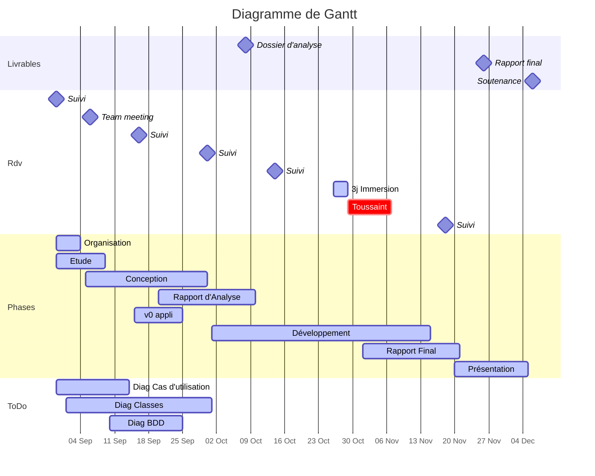

:::success
* **Sujet** : Conférence de jeu de rôle
* **Tuteur / Tutrice** : Cyriel Mallart (cyrielle.mallart@gmail.com)
* [Dépôt GitHub](https://github.com/ludo2ne/projet-info-2A)
    * Git ([Présentation](https://hackmd.io/AOSXJAJiR4q7GKdbiKcKsw) - [TP initiation](https://hackmd.io/BdGZF6qOTk2qvzAlvrz_WA))
* [Dossier d'analyse](https://www.overleaf.com/7459989917xsmkkjbfvdqs)
:::


-------------------------------------------
# :dart: Échéances
-------------------------------------------

:::danger
Dossier d'Analyse :clock1: <iframe src="https://free.timeanddate.com/countdown/i83zdl7u/n1264/cf11/cm0/cu2/ct4/cs0/ca0/co0/cr0/ss0/cac009/cpcf00/pcfff/tcfff/fs100/szw256/szh108/iso2022-10-08T23:59:00" allowtransparency="true" frameborder="0" width="130" height="16"></iframe>
:::





| Date    | Livrables                                                    |
| ------- | ------------------------------------------------------------ |
| 16 sept | ~~Avoir une v0 des différents diagrammes~~
| 08 oct. | [Dossier d'analyse](https://www.overleaf.com/7459989917xsmkkjbfvdqs) (:hammer_and_wrench:  [correcteur orthographe et grammaire](https://www.scribens.fr/))
| 26 nov. | Rapport final                                                | 


-------------------------------------------
# :construction: Todo 
-------------------------------------------


### :rotating_light: Rédaction du dossier d'analyse

* [ ] Regrouper tous les diagrammes de classe [color=orange][name=Jason] 
* Introduction 
    * optionnel : plutôt pour rapport final ?
* Cahier des charges
    * [ ] rédaction [color=red][name=JF ?]
    * [ ] relecture
* Fonctionnalités
    * [ ] ajouter Organisateur -> Supprimer un MJ d'une table
    * [ ] rédaction [color=red][name=JF ?]
    * [ ] relecture
* Organisation équipe 
    * [ ] rédaction  [color=green][name=Ludo]
    * [ ] relecture 
* [ ] couche business_objet 
    * [ ] rédaction [color=purple][name=Hugo]
    * [ ] relecture
* [ ] couche service 
    * [ ] rédaction [color=purple][name=Hugo] 1-8 --- [color=green][name=Ludo] 9-16
    * [ ] relecture
* [ ] Couche vue
    * [ ] rédaction [color=blue][name=Banruo] 
    * [ ] relecture
* [ ] couche DAO 
    * [ ] rédaction [color=orange][name=Jason] 
    * [ ] relecture 

---

### Organisation d'équipe

* Création des dépôts locaux et faire tourner la v0 sur chacun des postes
    * [x] Banruo et JF
    * [ ] Hugo et Jason
* [ ] Vérifier paramétrage VSCode de tout le monde (autopep8)
* Rédaction du dossier d'analyse
    * [ ] Expliquer le fonctionnement des commentaires
* Partages de connaissances
    * [ ] formation à Git
    * [x] formation à la programmation en couches


---

### Modifications diagramme

* [ ] Supprimer les méthodes de service se_deconnecter() ? se_deconnecter() = retour à AccueilVue et suppression du compte en session donc pas de service à appeler ?


---

### Développement

* [x] [POC](https://fr.wikipedia.org/wiki/Preuve_de_concept) : faire tourner la v0.0 sur la programmation en couche :arrow_right: Ludo
* [ ] tuto pour utiliser une BDD postgre sur son poste :arrow_right: Hugo


---


### :question: Questions à la tutrice ou entre nous

* [ ] Appels à l'API
    * lors de la création, le joueur choisit la classe du Personnage
    * on récupére auprès de l'API plus d'info sur la classe
        * compétences ==proficiencies== + compétences optionnelles (choix à faire)
        * équipement ==equipment== + équipement optionnel (choix à faire)
        * caractéristiques ==features== selon le niveau, ex : "Reckless Attack"
* Est-ce que l'on doit utiliser toutes les caractèristiques des personnages fournies par l'[api](https://www.dnd5eapi.co/) ?
    * Non, à minima classe et race
* [ ] Que se passe-t-il lorsqu'un Maitre du jeu quitte la table ? Les joueurs sont virés de la table ou pas ?
* Distinction entre joueur et MJ ?
    * [x] le choix se fait à l'inscription -> ok pour la tutrice
    * [ ] le joueur a une action ==devenir MJ==
    * [ ] les organisateurs peuvent promouvoir un joueur en MJ

---

* est-ce que les joueurs doivent avoir un attribut "niveau" ? Non
* est-ce que l'on peut mettre tous les attributs en public ? Petit oui
* Qui choisit le scénario d'une table, MJ ou organisateur ? MJ
* « Les organisateurs se réservent le droit ... de réorganiser les tables » : plus précisément ? Déplacer les joueurs


-------------------------------------------
# :mag_right: Dossier d'Analyse 
-------------------------------------------

* [x] Initialiser [projet latex sur overleaf](https://www.overleaf.com/7459989917xsmkkjbfvdqs)
    * [x] vérifier que tout le monde y a accès
* [x] Demander exemple à Noël

### Consignes

* max 15 pages
* justifier les choix
* [Diagrammes, voir sur GitHub](https://github.com/ludo2ne/projet-info-2A/tree/main/doc/diagrammes)
    * Diag Gantt
    * Diag classe
    * Diag cas utilisation
    * Schéma de BDD


### :arrow_forward: Diagramme de classes

Le fait de programmer en couches fait que le diagramme de classes va être découpé en suivant ces mêmes couches.

Pour faire l'analogie avec un exemple un peu plus concret, imaginez le découpage en couche d'un site internet : 
* la couche Vue est uniquement de l'affichage (mise en forme) des pages web
    * il y a des boutons qui renvoient vers d'autres pages et/ou appellent des Services lorsque l'on clique dessus
* la couche Service contient le coeur des méthodes métiers
* la couche DAO permet de faire des requêtes en base de données


#### [Diagramme de classe des vues](https://github.com/ludo2ne/projet-info-2A/blob/main/doc/diagrammes/diag_classe_vues.txt)

La couche ==Vue== est la plus "proche" de l'utilisateur, ce sont elles qui permettent de faire l'interface entre l'Homme et la Machine (IHM). Les classes de cette couche vont contenir les méthodes qui sont proposées à l'utilisateur (se connecter, créer un compte, créer un personnage, rejoindre une table...)

Tout ce que font les classes Vue est : 
* afficher un menu
* lorsque l'utilisateur a effectué son choix
    * appel à des méthodes de ==Service== pour effectuer la tâche demandée
    * puis retour au menu (ou celui d'une autre classe ==Vue==)

exemple de Menus : 
```
Vue utilisateur non connecté
1. s_inscrire()
2. se_connecter()
3. quitter()

Vue joueur
1. creer_personnage()
2. rejoindre_table()
3. se_deconnecter()
...
```


#### [Diagramme de classe des services](https://github.com/ludo2ne/projet-info-2A/blob/main/doc/diagrammes/diag_classe_services.txt)

Elles vont lister tous les services proposés

#### Diagramme de classe des DAO :construction: 

Elles vont lister les méthodes permettant de lire et modifier la base de données

#### [Diagramme de classe des objets métier](https://github.com/ludo2ne/projet-info-2A/blob/main/doc/diagrammes/diag_classe_objets.txt)

Ce sont des classes avec uniquement des attributs (pas de méthode) qui représentent les objets métier dont nous avons besoin

:::info
**Exemple de cheminement entre les couches:**
* Le joueur est sur la vue ==JoueurVue==, il voit le menu des actions possibles pour un Joueur
* il choisit de sélectionner **Rejoindre une table**
    * cela appelle la méthode de service ==lister_tables_disponibles()== de la classe ==TableService==
        * cela appelle la méthode de dao ==lister_tables_disponibles()== de la classe ==TableDao== qui effectue la requête en base de données et retourne la liste de ==Table== (objet métier Table)
    * La méthode de service affiche cette liste
* le joueur saisit le numéro de la table qu'il veut rejoindre
    * si le numéro est valide
        * appel de la méthode rejoindre_table() de la classe ==JoueurService==
            * appel de la méthode ajouter_joueur_table() de la classe ==JoueurDao== qui effectue la requête d'INSERT
* affichage d'un message si ça s'est bien passé ou pas...
* le joueur est renvoyé vers la vue ==JoueurVue==
:::

### :arrow_forward: Diagramme de cas d'utilisation


:::spoiler v1

:::


:::spoiler v2

:::

##### :bulb: Réflexions

* Déplacer joueur ? ie Supprimer d'une table ? + Ajouter à une table ?
* Se désister ? Quitter table
* Chosir personnage (Joueur) :arrow_right: En s'inscrivant à une table
* Joueur : :heavy_plus_sign: voir les tables sur lesquelles il est inscrit
* Voir message : à mon avis, ne pas mettre dans ce diagramme mais dans le commentaire du diagramme en disant que telle action va entrainer l'affichage d'un message au joueur


### Gantt

* Organisation
    * lister points forts de chacun, puis répartition des rôles
    * besoins de formation
    * bonne conduite : communiquer, respecter les autres, être solidaires, être force de proposition, ne pas faire en dernière minute
    * outils : 
        * suivi : hackMd, discord
        * analyse : [PlantUML](https://www.plantuml.com/plantuml/uml/SyfFKj2rKt3CoKnELR1Io4ZDoSa70000) ([features](https://plantuml.com/fr/class-diagram))
        * dev : python, DBeaver, postgre, fastApi
        * gestion de version : Git, GitHub
        * rédaction : LateX
* Etude
* Conception
* POC (Preuve de Concept)
    * coder une fonctionnalité basique
    * et vérifier que cela fonctionne bien


-------------------------------------------
# :robot_face: Code 
-------------------------------------------

* [ ] tester [un appel à l'api](https://www.dnd5eapi.co/)
* tests
    * [ ] voir comment lancer tous les tests
    * [ ] voir comment tester les dao sans polluer la bdd
* sans doute besoin de créer un objet Sceance qui correspondrait à une demi-journée
    * utile quand on requête si on veut vérifier qu'un joueur n'est pas déjà occupé à plusieurs tables sur la même demi-journée
    * sinon faut comparer des horaires de tables et c'est chiant...


### :construction_worker: Méthodes à coder 


#### Utilisateur non connecté

* [ ] AccueilVue.**s_inscrire(nom, prenom...)**
    * [ ] JoueurService.s_inscrire(nom, prenom...)
        * Vérifier que tous les champs remplis sont ok (non vides, mail contient @)
        * [ ] JoueurDAO.verifier_pseudo_existe_pas_deja()
        * [ ] JoueurDAO.creer()
            * `INSERT INTO joueur...`
* [ ] AccueilVue.**se_connecter(pseudo)**
    * si pseudo = Admin... sinon
    * [x] JoueurService.se_connecter(pseudo)
        * [x] JoueurDAO.find_by_pseudo(pseudo)
            * `SELECT * FROM joueur WHERE pseudo = ...`
    * [x] :warning: trouver un moyen de garder le joueur en "session"

---

#### Joueur

* [ ] JoueurVue.**creer_personnage()**
    * [ ] PersonnageService.creer()
        * vérifier qu'il n'a pas dejà 3 personnages
        * [ ] appel API
        * [ ] PersonnageDAO.creer()
* [ ] JoueurVue.**supprimer_personnage()**
* [ ] JoueurVue.**lister_personnages()**
* [ ] JoueurVue.**rejoindre_table()**
    * 1. lister les tables disponibles 
    * 2. le joueur sélectionne la table qu'il veut
    * 3. vérifier que le joueur n'est pas déjà occupé à cet horaire
    * 4. ajouter joueur à la table
* [ ] JoueurVue.**quitter_table()**
* [ ] JoueurVue.**voir_programme()**
    * afficher son programme
* [ ] JoueurVue.**voir_messages()**
    * nous avions dit que les messages s'affichaient lors de la connexion
    * on peut également imaginer une fonctionnalité qui permet au joueurs d'afficher tous ces messages
* [ ] JoueurVue.**supprimer_son_compte()**
* [ ] JoueurVue.**se_deconnecter()**

---

#### Maitre du Jeu

* [ ] MaitreJeuVue.**gerer_table()**
    * S'assoir à une table en tant que MJ et proposé un scénario
* [ ] MaitreJeuVue.**résilier_table()**
    * Si le MJ veut quitter la table
    * Faire en sorte que tous les joueurs quittent la table
* [ ] MaitreJeuVue.**voir_joueurs(Table)**


---

#### Administrateur

* [ ] AdministrateurVue.**creer_table()**
* [ ] AdministrateurVue.**supprimer_table()**
* [ ] AdministrateurVue.**deplacer_personnage()**
* [ ] AdministrateurVue.**supprimer_joueur()**
* [ ] AdministrateurVue.**voir_programme_complet()**
    * lister les tables et les joueurs/personnages assis


-------------------------------------------
# :cyclone: Base de données 
-------------------------------------------

### DBeaver

* Preference
    * Formattage SQL
        * Casse des mots clefs : UPPER
        * [x] Insert spaces for tabs
    * Templates
        * sf > Modifier
            * Schéma = 
```
SELECT * 
  FROM jdr.
```


Pour créer une connexion vers la base de données ENSAI sur la VM : 
* cliquer sur icone ==Nouvelle connexion== en haut à gauche sous fichier
* PostgreSQL puis suivant
    * Host : sgbd-eleves.domensai.ecole
    * Port : 5432
    * Database : idxxxx
    * Nom d'utilisateur : idxxxx
    * Mot de passe : idxxxx
* cliquer sur l'icone ==SQL== 
    * coller les scripts ci-dessous (à la racine du projet)
    * à chaque fois cliquer sur la 3e icone orange ==Executer le script SQL==
        * init_db.sql
        * pop_db.sql
* effacer tout
    * faire ==SELECT * FROM jdr.joueurs;==
    * puis CTRL+ENTREE


-------------------------------------------
# :calendar: Timeline 
-------------------------------------------

### 2022.09.30 Suivi 3

* Conseil tutrice : se spécialiser en dev (dao, service, vue)
* Créer une classe de pour garder le pseudo en session
* Mettre toutes les classes sur un seul diagramme
* Répartition de la rédaction du rapport


### 2022.09.22 Découpage diagramme de classe

* Découpage en suivant les couches

### 2022.09.20 v0.1

* Finalisation de la version 0.1 du programme
* BDD simple créée et poppée
* Vues simples crées
* Fonctionnalité "S'incscire" développée de bout en bout

### 2022.09.16 2e scéance

* Finalisation diagramme de Cas d'utilisation
* Maj diagramme classe
* Initialisation du diag de BDD


### 2022.09.15 Mise à jour diagrammes

* diagramme de Gantt
* organisation de l'équipe


### 2022.09.07 Création du projet GitHub

* il contiendra la documentation
* création d'une v0.0 du code en cours pour expliquer la programmation en couches


### 2022.09.06 Réunion d'équipe

* Diagramme de classe
* discussion des choix et des fonctionnalité
* version 2 du diagramme de cas d'utilisation


### 2022.08.30 Première scéance

les attendus du projet :
* Fiches de suivi
    * la tutrice veut simplement savoir ce qu'on a fait et où on en est
    * pas besoin de s'emmer*** avec ça, juste noter ce qu'on fait
* création d'un espace de discussion sur Discord


-------------------------------------------
# :clown_face: Rôles 
-------------------------------------------

* Chef de projet :arrow_right: Ludo
    * Suivi du projet, organisation et vérifie que chacun sait ce qu'il doit faire
* Communication avec la tutrice :arrow_right: Hugo
    * est sympa avec elle pour avoir une bonne note :wink: 
* Maître du temps :arrow_right: Banruo
    * s'assure que les délais sont bien respectés
* Rédacteur en chef :arrow_right: JF
    * validation des rapports, mise en forme, corrections
* Expert technique :arrow_right: Jason
    * Assiste les développeurs en cas de problème technique
* Développeurs :arrow_right: Tout le monde


-------------------------------------------
# :gift: Le sujet
-------------------------------------------


Une nouvelle convention de jeu de rôle arrive à Rennes ! L’activité phare de la convention sera un weekend dédié à la pratique des jeux de rôles. Plusieurs jeux se dérouleront en parallèle, chacun à une table contenant un maître/une maîtresse du jeu (MJ), ainsi que des joueurs et joueuses. Le but de ce weekend est de réunir des gens de tous horizons, de donner une première impression du jeu de rôle aux personnes n’ayant jamais essayé, mais aussi de satisfaire les joueurs plus expérimentés. Le système de jeu utilisé est Dongeons et Dragons 5E.

Les organisateurs vous sollicitent pour créer une application qui permette de gérer les tables de jeu de la conférence. Il faudra créer deux interfaces différentes : une pour les organisateurs et une pour un joueur ou MJ.

Un joueur ou une joueuse s’inscrit à la conférence en renseignant un nouveau profil. Sur ce profil, il ou elle peut déclarer des personnages différents. En utilisant l’API disponible à l’adresse https://www.dnd5eapi.co/, plus d’informations seront colléctées sur chaque personnage, et completeront sa fiche, comme les langues que le personnage parle, ses capacités physiques, etc. Une joueuse doit aussi pouvoir s’inscrire à une table, et consulter les tables auxquelles elle joue.

Les MJs ont accès à un profil similaire, où ils peuvent se porter volontaires pour plusieurs scénarios (et donc plusieurs tables). Le MJ doit aussi avoir accès à une liste des joueurs et des personnages qui seront à sa table, afin de pouvoir se préparer au mieux.

Les organisateurs se réservent le droit de supprimer des joueurs et des MJ, et de réorganiser les tables. Dans ce cas, un tel évènement sera notifié aux joueurs concernés lorsqu’ils iront consulter les tables auxquelles ils jouent.


### Fonctionnalités

* Authentification sommaire des profils organisateur/joueur/MJ
* Inscription pour un nouveau joueur ou MJ
* Complétion des fiches personnages via l’API
* Inscription/désistement à une table (avec gestion des contraintes)
* Vue du programme individuel pour chaque joueur
* Ajout/suppression des joueurs à une table
* Création/suppession de tables
* Vue générale du programme (tables, joueurs, MJs et horaires)

### Fonctionnalités avancées

* Recherche du programme d’un joueur particulier par un organisateur
* Validation des personnages par le MJ avant inscription définitive à une table
* Gestion d’un second système de jeu (Pathfinder, Call of Chtulu ou Monster of the Week, par exemple)

Aucune interface graphique n'est demandée dans ce sujet
