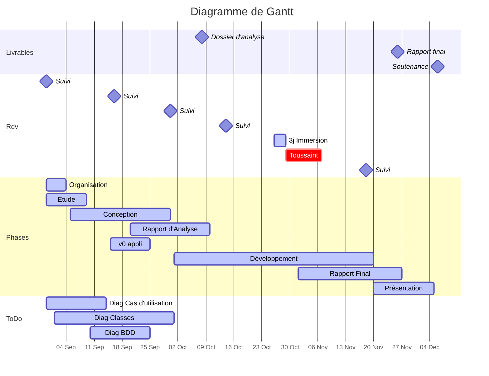

:::success
* **Sujet** : Conférence de jeu de rôle
* **Tutrice** : Cyriel Mallart (cyrielle.mallart@gmail.com)
* [Dépôt GitHub](https://github.com/ludo2ne/projet-info-2A)
    * Git ([Présentation](https://hackmd.io/AOSXJAJiR4q7GKdbiKcKsw) - [TP initiation](https://hackmd.io/BdGZF6qOTk2qvzAlvrz_WA))
* [Dossier d'analyse](https://www.overleaf.com/7459989917xsmkkjbfvdqs)
* [Rapport final](https://www.overleaf.com/2118446326mqvrspgxdcnj)
:::


-------------------------------------------
# :dart: Échéances
-------------------------------------------

:::danger 
Rapport final :clock1: <iframe src="https://free.timeanddate.com/countdown/i83zdl7u/n1264/cf11/cm0/cu2/ct4/cs0/ca0/co0/cr0/ss0/cac009/cpcf00/pcfff/tcfff/fs100/szw256/szh108/iso2022-11-26T23:59:00" allowtransparency="true" frameborder="0" width="130" height="16"></iframe>
:::

---





| Date    | Livrables                                                    |
| ------- | ------------------------------------------------------------ |
| 16 sept | ~~Avoir une v0 des différents diagrammes~~
| 08 oct. | ~~[Dossier d'analyse](https://www.overleaf.com/7459989917xsmkkjbfvdqs)~~ 
| 26 nov. | [Rapport final](https://www.overleaf.com/2118446326mqvrspgxdcnj) (:hammer_and_wrench:  [correcteur orthographe et grammaire](https://www.scribens.fr/)) | 
|  6 déc. | PPT soutenance                                               |


# :truck: Livraison du 26/11 à 20:00

### Code

* Supprimer les dossiers `__pycache__`
    * `find . -type d -name __pycache__ -exec rm -r {} \+`
* Supprimer .env
* Supprimer fichier `Utilisation Git sur un projet`
* ZIP
    * Nom de l'archive : ==code_equipe_24.zip==


### Rapport

* Nom du fichier : ==rapport_final_equipe_24.pdf==


-------------------------------------------
# :checkered_flag: Dernière ligne droite (ou presque)
-------------------------------------------

TOUT LE MONDE est concerné par les tâches suivantes : 

* Tester l'application de fond en comble "manuellement" :clock1: <iframe src="https://free.timeanddate.com/countdown/i83zdl7u/n1264/cf11/cm0/cu2/ct4/cs0/ca0/co0/cr0/ss0/cac009/cpcf00/pcfff/tcfff/fs100/szw256/szh108/iso2022-11-23T23:59:00" allowtransparency="true" frameborder="0" width="130" height="16"></iframe>
    * [x] [color=green][name=Ludo] 
    * [ ] [color=purple][name=Hugo] 
    * [ ] [color=blue][name=Banruo] 
    * [ ] [color=orange][name=Jason] 
    * [ ] [color=red][name=JF]
    * et rapporter les bugs s'ils sont trop compliqués à corriger
* [x] Tests unitaires classe **table_jeu_service** :clock1: <iframe src="https://free.timeanddate.com/countdown/i83zdl7u/n1264/cf11/cm0/cu2/ct4/cs0/ca0/co0/cr0/ss0/cac009/cpcf00/pcfff/tcfff/fs100/szw256/szh108/iso2022-11-24T23:59:00" allowtransparency="true" frameborder="0" width="130" height="16"></iframe>
    *  [color=green][name=Ludo] : "J'ai commencé, je vous laisse terminer"
* Rédaction rapport :clock1: <iframe src="https://free.timeanddate.com/countdown/i83zdl7u/n1264/cf11/cm0/cu2/ct4/cs0/ca0/co0/cr0/ss0/cac009/cpcf00/pcfff/tcfff/fs100/szw256/szh108/iso2022-11-25T23:59:00" allowtransparency="true" frameborder="0" width="130" height="16"></iframe>
    * [x] Relire parties 1 et 2 et éventuellement les mettre à jour
* Relecture rapport :clock1: <iframe src="https://free.timeanddate.com/countdown/i83zdl7u/n1264/cf11/cm0/cu2/ct4/cs0/ca0/co0/cr0/ss0/cac009/cpcf00/pcfff/tcfff/fs100/szw256/szh108/iso2022-11-26T23:59:00" allowtransparency="true" frameborder="0" width="130" height="16"></iframe>
    * [x] [color=green][name=Ludo] 
    * [ ] [color=purple][name=Hugo] 
    * [ ] [color=blue][name=Banruo] 
    * [ ] [color=orange][name=Jason] 
    * [x] [color=red][name=JF]


-------------------------------------------
# :bulb: Reste à faire 
-------------------------------------------

### :question: Questions tutrice 28/10/22

* [x] Notice élève 3d) : "votre travail devra comporter l’importation ou l’exportation d’un jeu de données" :arrow_right: inutile


### :robot_face: Code 

* [ ] Tester de A à Z toutes les méthodes d'une **classe de service** : ==table_jeu_service== [color=blue][name=Banruo]
    * https://gayerie.dev/docs/python/python3/unittest.html
    * [Voir tests sur les pokemons](https://gitlab.com/remi2J/complement_info_ensai_2022_2023/-/tree/tp4_base/tests/test_services)
    * cas nominaux
    * cas d'erreurs
* [ ] Documenter les classes et méthodes [color=orange][name=Jason]
    * principalement service et dao
    * [ ] Puis [générer la doc sous format html avec pydoc](https://docs.python.org/fr/3/library/pydoc.html) (optionnel)
* [ ] `admin` dans la table joueur -> essayer de vite fait mettre au propre
* [ ] Rechercher et "Résoudre" les TODO
* [x] Renommer `lancement_appli.py` en `main.py`
* [ ] Fichier README.txt
    * Rédigé en Anglais
    * 1. Présenter rapidement l'application avec quelques exemples
    * 2. Comment installer l'application
* [x] Fichier requirements.txt (install packages python) [color=green][name=Ludo] 
* [ ] Bonus (bien vu de faire un petit bonus selon les dires de la Tutrice), par exemple : 
    * voir_messages
    * ajouter mot de passe
    * créer une api simple pour exposer des données (par exemple, le programme complet)
* Tester l'appli de fond en comble 
    * si vous trouvez un bug, 2 possibilités (corriger ou répertorier ci-dessous)
    * erreurs dans l'interface ou manque d'ergonomie, idem corriger ou répertorier 
    * si 2 méthodes font presque la meme chose :arrow_right: bug


### :ant: Bugs 

* [x] Admin > Supprimer un joueur `'list' object has no attribute 'pseudo'`


### :rainbow: Ergonomie à améliorer

* [x] MaitreJeu > Gerer Table 
    * [x] `Vous ne pouvez pas jouer à tables en même temps`
    * [x] Ajouter possibilité "J'ai changé d'avis"
    * [x] Si non libre pour une séance
        * soit dire tout de suite après sélecion de la séance
        * soit ne pas afficher les séances non disponibles
* [ ] Admin > Voir programme complet (léger)
* [x] Admin > Supprimer les tables sans joueurs, proposer un choix contenant : 
    * la liste des tables vides
    * toutes (pour supprimer toutes les tables vides)

### Autres

* [x] BDD : Ajouter les clés étrangères [color=green][name=Ludo]
* [ ] Important : tester l'installation de l'application sur une nouvelle machine 
* [x] tester une injection SQL
    * Entrez votre pseudo : ;DROP TABLE jdr.joueur CASCADE;--
    * Entrez votre pseudo : ;DROP SCHEMA jdr CASCADE;-- 
    * Entrez votre pseudo : ;SELECT * FROM jdr.joueur--


### :pencil:  Rapport final 

* [ ] **Mettre à jour diagramme de classes**
    * Inutile de mettre toutes les vues (dixit la tutrice)
    * Se concentrer sur Service, DAO et business_objets
* [x] Initialiser les sections à rédiger [color=green][name=Ludo] 
* [x] se répartir les sections
* :arrow_right: à torcher dès que les partiels sont terminés


-------------------------------------------
# :pencil: Rapport Final 
-------------------------------------------

:::info
* ++[Lien overleaf](https://www.overleaf.com/2118446326mqvrspgxdcnj)++
* Voir Moodle, notice élève, section 3e
* Doit décrire et valoriser le travail produit
* 25 pages hors annexes
:::

### 1. Contexte de l'application

* À quels besoins répond-elle ? Diagramme cas d’utilisation NON nécessaire
* Quels sont les utilisateurs ?
* Architecture « macro » de votre application
    * IHM console, technologies utilisées, schéma d’architecture (couches)

### 2. Architecture du code 

* Diagramme de classe 
    * Commenter le diagramme, explication des héritages/associations
    * Présentation des objets métiers et comment ils sont utilisés
    * Mise en avant d’une décomposition en couche, d’un découplage entre les objets
* Fonctionnement du code
    * Faire un Zoom sur une fonctionnalité centrale (en la détaillant complètement)
        * Qu’est-ce que l’utilisateur fait ? Qu’est-ce que le code fait ? Comment interagit-il avec les autre composant ? Quelles sont les classes utilisées ?
    * Explication rapide pour les autres fonctionnalités
        * NE PAS faire un listing des fonctions pythons
* Présentation du système de stockage (Base de Données)
    * à quels moments il est utilisé dans votre application

### 3. Parler des perspectives d'évolution

trucs qu'on aurait aimé faire mais manque de temps...

### Note individuelle

* voir section 3f
* Vous pouvez adopter un style moins formel que pour le rapport
* > [color=blue] "faites-la sérieusement et honnêtement"
* 1. Votre participation effective au projet (roles)
* 2. Comment avez-vous vécu le projet avec votre groupe. Est-ce difficile ? Enrichissant ?
* 3. Les enseignements que vous en tirez, ce que vous referiez, ce que vous changerez. En gros, quels conseils que vous donnez à vos successeurs ?


-------------------------------------------
# :tada: Soutenance
-------------------------------------------
 
> [color=red] TODO (section 3g)

:::info
* IMPORTANT : 
    * ne pas lister les fonctionnalités de l'application
    * raconter une histoire, par exemple : 
        * JF est Maitre du jeu et propose un scéanario
        * Banruo veut participer à la conférence et va sur l'application
        * Elle trouve le scéanario de JF génial et s'inscrit à sa table
        * Mais la veille JF est malade et Hugo l'Admin désigne Jason pour remplacer JF
        * ...

:::

-------------------------------------------
# :robot_face: Code 
-------------------------------------------

### :arrow_forward: Utilisateur non connecté

* ==S'inscrire== [color=blue][name=Banruo]
    * [x] Basculer vers la vue InscriptionVue
        * [x] demander pseudo, nom, prenom, mail
        * [x] JoueurService.**creer(pseudo, nom, prenom, mail)**
            * [x] Vérifier que tous les champs remplis sont ok (non vides, mail contient @)
            * [x] JoueurDAO.**trouver_par_pseudo()**
            * si la méthode ci-dessus ne renvoi aucun résultat
            * [x] JoueurDAO.**creer()** `INSERT INTO jdr.joueur...`
* ==Se connecter==
    * Basculer vers la vue **ConnexionVue**
        * demander pseudo
            * [x] si pseudo = Admin... 
            * sinon
                * [x] JoueurService.trouver_par_pseudo(pseudo)
                    * [x] JoueurDAO.trouver_par_pseudo(pseudo)
            * Si pseudo trouvé
                * [x] conserver pseudo en Session
                * [x] basculer vers JoueurMenuVue
* ==Quitter==

---

### :arrow_forward: JoueurMenuVue

* [color=green][name=Ludo]  [color=purple][name=Hugo]               [color=blue][name=Banruo]  [color=orange][name=Jason]  [color=red][name=JF]

---

* ==Créer un personnage== [color=purple][name=Hugo]
    * [x] Basculer vers la vue CreerPersonnageVue
        * demander infos sur le personnage (nom, classe, race, niveau)
        * [x] PersonnageService.**creer(nom, classe, race, niveau)**
            * [x] vérifier qu'il n'a pas dejà 3 personnages
            * [x] vérifier que classe et race existent ? faire une liste ?
            * [x] appel API
            * [x] PersonnageDAO.**creer()**
            * [ ] Interroger API pour obtenir compétences
                * [ ] convertir réponse API en liste
        * [ ] test DAO
    * [ ] Test Service
* :heart: ==Supprimer un personnage== [color=red][name=JF]
    * [x] Afficher la liste des personnages
        * [x] JoueurService.**lister_personnage()**
    * [x] Basculer vers SupprimerPersonnageVue
        * demander le nom du Personnage
        * [x] Demander de confirmer la suppression
        * [ ] JoueurService.**supprimer_personnage()**
            * vérifier que le Personnage n'est pas inscrit à une table
                * [ ] PersonnageDao.**lister_tables()**
            * [x] PersonnageDao.**supprimer()**
    * [x] :warning: si le joueur n'a aucun Personnage
* :heart: ==Lister ses personnages== [color=blue][name=Banruo]
    * [x] JoueurService.**lister_personnages()**
        * [x] récupérer le pseudo du joueur en session (pseudo = Session.pseudo)
        * [x] JoueurDao.**trouver_par_pseudo(pseudo)**
        * [x] PersonnageDao.**lister_par_joueur(Joueur)**
        * [ ] TestJoueurDao
    * [ ] TestJoueurService
* :fire: ==Rejoindre une table== [color=red][name=JF]
    * [x] Choisir un horaire
    * [x] Vérifier que le joueur n'est pas déjà occupé à cet horaire, en tant que joueur ou MJ
    * [x] lister les tables disponibles à cet horaire
    * [x] le joueur sélectionne la table qu'il veut
    * [x] ajouter Personnage à la table
* ==Quitter une table== [color=orange][name=Jason]
    * Lister les tables ou le joueur est
        * [x] JoueurService.voir_son_programme()
    * Basculer vers la QuitterTableVue
        * Demander le numéro de table qu'il veut quitter
        * [x] JoueurService.**quitter_table()**
            * [x] JoueurDao (ou PersonnageDao).**quitter_table()** 
* :heart: ==Voir son programme== [color=orange][name=Jason]
    * [ ] JoueurService.**voir_son_programme()**
        * [x] récupérer le joueur en session : *joueur = Session().user*
        * [x] JoueurDao.**voir_son_programme()**
        * [ ] TestJoueurDao
    * [ ] TestJoueurService
* :heart: ==Voir messages== [color=blue][name=Banruo]
    * [x] JoueurService.**voir_messages()** 
        * [x] récupérer le joueur en session : *joueur = Session().user*
        * [x] MessageDao.**lister_par_joueur(Joueur)**
        * [ ] TestMessageDao
    * [ ] TestJoueurService
* :heart: ==Supprimer son compte== [color=red][name=JF]
    * [x] basculer vers une vue qui pose la question : Etes vous sur ?
        * [x] JoueurService.supprimer()
            * [x] Récupérer le joueur en session
            * [x] PersonnageDao.**lister_par_joueur()**
            * [x] PersonnageDao.**quitter_table()**
            * [x] PersonnageDao.**supprimer()**
            * [x] JoueurDao.**supprimer_compte(joueur)**
                * DELETE FROM jdr.joueur WHERE pseudo =
            * [x] Notifier admin
    * [x] revenir vers AccueilVue
* ==Devenir Maître du Jeu== [color=red][name=JF]
    * [x] Vérifier si le Joueur n'est pas MJ
    * [x] Basculer vers DevenirMaitreJeuVue
        * [x] MaitreJeuService.devenir_mj()
            * [x] MaitreJeuDao.devenir_mj()
        * [x] Modifier Session().user

             
* ==Accéder au Menu Maître du Jeu== [color=green][name=Ludo]
    * [x] Vérifier si le Joueur est bien MJ
    * [x] Basculer vers MaitreJeuMenuVue
* ==Se déconnecter== [color=green][name=Ludo]
    * [x] Supprimer le pseudo de la Session
    * [x] Basculer vers AccueilVue

---

### :arrow_forward: MaitreJeuMenuVue


* ==Gérer une Table== [color=blue][name=Banruo]
    * [x] Basculer vers GererTableVue
        * Demander pour quelle séance
        * Demander quel scénario et quelles infos complémentaires
        * [x] MaitreJeuService.**gerer_table()**
            * [x] Vérifier que le MJ est libre pour la séance
            * [x] Vérifier s'il y a une table disponible
            * [x] TableDao.**gerer_par_mj()**
                * SET jdr.table SET mj = , scénario = , info_comp =
* ==Résilier une Table== [color=red][name=JF]
    * [x] Lister les table ou il est MJ
    * [x] Basculer vers ResilierTableVue
        * Demander le numero de la table
        * [x] MaitreJeuService.**quitter_table()**
            * [x] MaitreJeuDao.quitter_table()
* ==Voir les Tables gérées==[color=red][name=JF]
    * Afficher les tables ou il est MJ avec les Personnages
    * [x] MaitreJeuService.**voir_tables_gerees()**
        * [x] TableDao.lister()


---

### :arrow_forward: AdministrateurMenuVue


* ==Lister les joueurs== [color=blue][name=Banruo]
    * lister pseudo, noms, prenom, mail, est mj
    * [x] AdministrateurService.**lister_joueurs()**
        * [x] JoueurDao.**lister_tous()**
        * [x] mettre en forme avec tabulate
* ==Créer une Table== [color=purple][name=Hugo]
    * [x] Basculer vers la vue AdministrateurCreerTableVue
        * [x] Demander pour quelle seance
        * [x] AdministrateurService.**creer_table()**
            * [x] TableJeuDao.**creer()**
* ==Supprimer une Table== [color=purple][name=Hugo] 
    * [x] Lister les table vides
        * [x] AdministrateurService.**lister_tables_vides()**
    * [ ] Basculer vers la vue AdministrateurCreerTableVue
        * Demander le numéro de table
        * [x] AdministrateurService.**supprimer_table()**
            * [x] TableJeuDao.**supprimer()**
* ==Supprimer un joueur== [color=purple][name=Hugo]
    * [x] Lister les joueurs
    * [x] Basculer vers la vue SupprimerJoueurVue
        * Demander le pseudo du joueur
        * [x] AdministrateurService.**supprimer_joueur()**
            * [x] JoueurDao.**supprimer()**
* ==Voir le programme complet== [color=green][name=Ludo]
    * [x] AdministrateurService.**voir_programme_complet()**
        * [x] Mettre bien en forme le tableau
        * [x] TableDao.**lister(joueur, seance)**
            * méthode pour lister des tables par joueur, seance ou toutes les tables
* ==Voir les messages== [color=blue][name=Banruo]
    * idem que pour Joueur
    * [x] lister message de Admin
* :fire: ==Déplacer un Personnage== [color=green][name=Ludo]
    * [x] basculer vers Vue Déplacer personnage
        * [ ] :warning: Ne lister que les tables qui ont des joueurs
        * [x] choisir table et séance origine
        * [x] choisir personnage
        * [x] choisir table et séance destination
        * [x] PersonnageService().**quitter_table()**
        * [x] PersonnageService().**rejoindre_table()**
    * [x] Notifier joueur
    * [x] ajouter possibilité que table destination soit vide
    * [ ] à tester de fond en comble
* :fire: ==Déplacer un Maitre du Jeu== [color=green][name=Ludo]
    * il est possible de s'inspirer de **Déplacer un Personnage**
    * [x] Basculer vers DeplacerMaitreJeuVue
        * [x] lister tables
        * [x] choisir le MJ à déplacer
        * [x] lister autres tables de la même séance
        * [x] choisir table destination
        * [ ] message au MJ


-------------------------------------------
# :construction: Todo 
-------------------------------------------

### Organisation d'équipe

* [x] Création des dépôts locaux et faire tourner la v0 sur chacun des postes
* [x] Décocher connexions multiples dbeaver

---

### Développement

* [x] [POC](https://fr.wikipedia.org/wiki/Preuve_de_concept) : faire tourner la v0.0 sur la programmation en couche [color=green][name=Ludo]
* [x] tuto pour [utiliser une BDD postgre sur son poste](https://www.youtube.com/watch?v=Cc9d2c8UuKA) [color=purple][name=Hugo]
* [ ] Se spécialiser dans certaines couches ?
* [x] Lister quelques fonctionnalités simples pour débuter [color=green][name=Ludo]
    * [ ] Fournir à chacun un dév simple
* [x] tester [un appel à l'api](https://www.dnd5eapi.co/)
* [x] voir comment lancer tous les tests -> run_all_tests.py
* [x] script pour ré-initialiser la bdd -> utils/reset_database.py
* [ ] voir comment tester les dao sans polluer la bdd
    * avoir un schéma de données tests ?

---


### :question: Questions à la tutrice ou entre nous

* [ ] [color=green][name=Ludo] : est-ce qu'on a vraiment besoin d'un business object ==Administrateur== ?
* [color=green][name=Ludo] Points à éclairer
    * [ ] En bdd, pourquoi `seance` fait parti de la clé primaire d'une `table_jeu` ?
    * [ ] En bdd, ça me parait inévitable d'avoir une table `seance`
        * parce que dans le cas contraire dans notre appli, il n'y aura aucune info sur les horaires ni sur les demi-journées


---

* [ ] Appels à l'API
    * lors de la création, le joueur choisit la classe du Personnage
    * on récupére auprès de l'API plus d'info sur la classe
        * compétences ==proficiencies== + compétences optionnelles (choix à faire)
        * équipement ==equipment== + équipement optionnel (choix à faire)
        * caractéristiques ==features== selon le niveau, ex : "Reckless Attack"
* Est-ce que l'on doit utiliser toutes les caractèristiques des personnages fournies par l'[api](https://www.dnd5eapi.co/) ?
    * Non, à minima classe et race
* Que se passe-t-il lorsqu'un Maitre du jeu quitte la table ? Les joueurs sont virés de la table ou pas ? Non
* Distinction entre joueur et MJ ? le choix se fait à l'inscription -> ok pour la tutrice

---

* est-ce que les joueurs doivent avoir un attribut "niveau" ? Non
* est-ce que l'on peut mettre tous les attributs en public ? Petit oui
* Qui choisit le scénario d'une table, MJ ou organisateur ? MJ
* « Les organisateurs se réservent le droit ... de réorganiser les tables » : plus précisément ? Déplacer les joueurs

---


-------------------------------------------
# :cyclone: Base de données 
-------------------------------------------

### DBeaver

* Fenêtre > Preference
    * Formattage SQL
        * Casse des mots clefs : UPPER
        * [ ] Insert spaces for tabs
    * Templates
        * sf > Modifier
            * Schéma = ==SELECT * FROM jdr.==
    * Métadonnées
        * Décocher "Ouvrir une connexion séparée pour la lecture des métadonnées"
    * Editeur SQL
        * Décocher "Ouvrir une connexion séparée pour chaque éditeur"


Pour créer une connexion vers la base de données ENSAI sur la VM : 
* cliquer sur icone ==Nouvelle connexion== en haut à gauche sous fichier
* PostgreSQL puis suivant
    * Host : sgbd-eleves.domensai.ecole
    * Port : 5432
    * Database : idxxxx
    * Nom d'utilisateur : idxxxx
    * Mot de passe : idxxxx
* cliquer sur l'icone ==SQL== 
    * coller les scripts ci-dessous (à la racine du projet)
    * à chaque fois cliquer sur la 3e icone orange ==Executer le script SQL==
        * init_db.sql
        * pop_db.sql


-------------------------------------------
# :mag_right: Dossier d'Analyse 
-------------------------------------------


### :rotating_light: Rédaction du dossier d'analyse


* [x] Regrouper tous les diagrammes de classe [color=orange][name=Jason]
    * [x] Validation 
* Introduction 
    * [x] rédaction [color=red][name=JF]
* Cahier des charges
    * [x] rédaction [color=red][name=JF]
    * [x] relecture
* Fonctionnalités
    * [x] rédaction [color=red][name=JF]
    * [x] relecture [color=green][name=Ludo]
* Organisation équipe 
    * [x] rédaction  [color=green][name=Ludo]
    * [x] relecture 
* Couche business_objet 
    * [x] rédaction [color=purple][name=Hugo]
    * [x] relecture [color=green][name=Ludo]
* Couche service 
    * [x] rédaction [color=purple][name=Hugo] 1-8
    * [x] rédaction [color=green][name=Ludo] 9-16
    * [x] relecture
* Couche vue
    * [x] rédaction [color=blue][name=Banruo]
    * [x] relecture 
* Couche DAO 
    * [x] rédaction [color=orange][name=Jason] 
    * [x] relecture 
* [x] Validation finale [color=red][name=JF] [color=green][name=Ludo]

---

### Consignes

* max 15 pages
* justifier les choix
* [Diagrammes, voir sur GitHub](https://github.com/ludo2ne/projet-info-2A/tree/main/doc/diagrammes)
    * Diag Gantt
    * Diag classe
    * Diag cas utilisation
    * Schéma de BDD


### :arrow_forward: Diagramme de classes

Le fait de programmer en couches fait que le diagramme de classes va être découpé en suivant ces mêmes couches.

Pour faire l'analogie avec un exemple un peu plus concret, imaginez le découpage en couche d'un site internet : 
* la couche Vue est uniquement de l'affichage (mise en forme) des pages web
    * il y a des boutons qui renvoient vers d'autres pages et/ou appellent des Services lorsque l'on clique dessus
* la couche Service contient le coeur des méthodes métiers
* la couche DAO permet de faire des requêtes en base de données


#### [Diagramme de classe des vues](https://github.com/ludo2ne/projet-info-2A/blob/main/doc/diagrammes/diag_classe_vues.txt)

La couche ==Vue== est la plus "proche" de l'utilisateur, ce sont elles qui permettent de faire l'interface entre l'Homme et la Machine (IHM). Les classes de cette couche vont contenir les méthodes qui sont proposées à l'utilisateur (se connecter, créer un compte, créer un personnage, rejoindre une table...)

Tout ce que font les classes Vue est : 
* afficher un menu
* lorsque l'utilisateur a effectué son choix
    * appel à des méthodes de ==Service== pour effectuer la tâche demandée
    * puis retour au menu (ou celui d'une autre classe ==Vue==)

exemple de Menus : 
```
Vue utilisateur non connecté
1. s_inscrire()
2. se_connecter()
3. quitter()

Vue joueur
1. creer_personnage()
2. rejoindre_table()
3. se_deconnecter()
...
```


#### [Diagramme de classe des services](https://github.com/ludo2ne/projet-info-2A/blob/main/doc/diagrammes/diag_classe_services.txt)

Elles vont lister tous les services proposés

#### Diagramme de classe des DAO :construction: 

Elles vont lister les méthodes permettant de lire et modifier la base de données

#### [Diagramme de classe des objets métier](https://github.com/ludo2ne/projet-info-2A/blob/main/doc/diagrammes/diag_classe_objets.txt)

Ce sont des classes avec uniquement des attributs (pas de méthode) qui représentent les objets métier dont nous avons besoin

:::info
**Exemple de cheminement entre les couches:**
* Le joueur est sur la vue ==JoueurVue==, il voit le menu des actions possibles pour un Joueur
* il choisit de sélectionner **Rejoindre une table**
    * cela appelle la méthode de service ==lister_tables_disponibles()== de la classe ==TableService==
        * cela appelle la méthode de dao ==lister_tables_disponibles()== de la classe ==TableDao== qui effectue la requête en base de données et retourne la liste de ==Table== (objet métier Table)
    * La méthode de service affiche cette liste
* le joueur saisit le numéro de la table qu'il veut rejoindre
    * si le numéro est valide
        * appel de la méthode rejoindre_table() de la classe ==JoueurService==
            * appel de la méthode ajouter_joueur_table() de la classe ==JoueurDao== qui effectue la requête d'INSERT
* affichage d'un message si ça s'est bien passé ou pas...
* le joueur est renvoyé vers la vue ==JoueurVue==
:::

### :arrow_forward: Diagramme de cas d'utilisation


:::spoiler v1

:::


:::spoiler v2

:::

##### :bulb: Réflexions

* Déplacer joueur ? ie Supprimer d'une table ? + Ajouter à une table ?
* Se désister ? Quitter table
* Chosir personnage (Joueur) :arrow_right: En s'inscrivant à une table
* Joueur : :heavy_plus_sign: voir les tables sur lesquelles il est inscrit
* Voir message : à mon avis, ne pas mettre dans ce diagramme mais dans le commentaire du diagramme en disant que telle action va entrainer l'affichage d'un message au joueur


### Gantt

* Organisation
    * lister points forts de chacun, puis répartition des rôles
    * besoins de formation
    * bonne conduite : communiquer, respecter les autres, être solidaires, être force de proposition, ne pas faire en dernière minute
    * outils : 
        * suivi : hackMd, discord
        * analyse : [PlantUML](https://www.plantuml.com/plantuml/uml/SyfFKj2rKt3CoKnELR1Io4ZDoSa70000) ([features](https://plantuml.com/fr/class-diagram))
        * dev : python, DBeaver, postgre, fastApi
        * gestion de version : Git, GitHub
        * rédaction : LateX
* Etude
* Conception
* POC (Preuve de Concept)
    * coder une fonctionnalité basique
    * et vérifier que cela fonctionne bien


-------------------------------------------
# :calendar: Timeline 
-------------------------------------------

### 2022.09.30 Suivi 3

* Conseil tutrice : se spécialiser en dev (dao, service, vue)
* Créer une classe de pour garder le pseudo en session
* Mettre toutes les classes sur un seul diagramme
* Répartition de la rédaction du rapport


### 2022.09.22 Découpage diagramme de classe

* Découpage en suivant les couches

### 2022.09.20 v0.1

* Finalisation de la version 0.1 du programme
* BDD simple créée et poppée
* Vues simples crées
* Fonctionnalité "S'incscire" développée de bout en bout

### 2022.09.16 2e scéance

* Finalisation diagramme de Cas d'utilisation
* Maj diagramme classe
* Initialisation du diag de BDD


### 2022.09.15 Mise à jour diagrammes

* diagramme de Gantt
* organisation de l'équipe


### 2022.09.07 Création du projet GitHub

* il contiendra la documentation
* création d'une v0.0 du code en cours pour expliquer la programmation en couches


### 2022.09.06 Réunion d'équipe

* Diagramme de classe
* discussion des choix et des fonctionnalité
* version 2 du diagramme de cas d'utilisation


### 2022.08.30 Première scéance

les attendus du projet :
* Fiches de suivi
    * la tutrice veut simplement savoir ce qu'on a fait et où on en est
    * pas besoin de s'emmer*** avec ça, juste noter ce qu'on fait
* création d'un espace de discussion sur Discord


-------------------------------------------
# :clown_face: Rôles 
-------------------------------------------

* Chef de projet :arrow_right: Ludo
    * Suivi du projet, organisation et vérifie que chacun sait ce qu'il doit faire
* Communication avec la tutrice :arrow_right: Hugo
    * est sympa avec elle pour avoir une bonne note :wink: 
* Maître du temps :arrow_right: Banruo
    * s'assure que les délais sont bien respectés
* Rédacteur en chef :arrow_right: JF
    * validation des rapports, mise en forme, corrections
* Expert technique :arrow_right: Jason
    * Assiste les développeurs en cas de problème technique
* Développeurs :arrow_right: Tout le monde


-------------------------------------------
# :gift: Le sujet
-------------------------------------------


Une nouvelle convention de jeu de rôle arrive à Rennes ! L’activité phare de la convention sera un weekend dédié à la pratique des jeux de rôles. Plusieurs jeux se dérouleront en parallèle, chacun à une table contenant un maître/une maîtresse du jeu (MJ), ainsi que des joueurs et joueuses. Le but de ce weekend est de réunir des gens de tous horizons, de donner une première impression du jeu de rôle aux personnes n’ayant jamais essayé, mais aussi de satisfaire les joueurs plus expérimentés. Le système de jeu utilisé est Dongeons et Dragons 5E.

Les organisateurs vous sollicitent pour créer une application qui permette de gérer les tables de jeu de la conférence. Il faudra créer deux interfaces différentes : une pour les organisateurs et une pour un joueur ou MJ.

Un joueur ou une joueuse s’inscrit à la conférence en renseignant un nouveau profil. Sur ce profil, il ou elle peut déclarer des personnages différents. En utilisant l’API disponible à l’adresse https://www.dnd5eapi.co/, plus d’informations seront colléctées sur chaque personnage, et completeront sa fiche, comme les langues que le personnage parle, ses capacités physiques, etc. Une joueuse doit aussi pouvoir s’inscrire à une table, et consulter les tables auxquelles elle joue.

Les MJs ont accès à un profil similaire, où ils peuvent se porter volontaires pour plusieurs scénarios (et donc plusieurs tables). Le MJ doit aussi avoir accès à une liste des joueurs et des personnages qui seront à sa table, afin de pouvoir se préparer au mieux.

Les organisateurs se réservent le droit de supprimer des joueurs et des MJ, et de réorganiser les tables. Dans ce cas, un tel évènement sera notifié aux joueurs concernés lorsqu’ils iront consulter les tables auxquelles ils jouent.


### Fonctionnalités

* Authentification sommaire des profils organisateur/joueur/MJ
* Inscription pour un nouveau joueur ou MJ
* Complétion des fiches personnages via l’API
* Inscription/désistement à une table (avec gestion des contraintes)
* Vue du programme individuel pour chaque joueur
* Ajout/suppression des joueurs à une table
* Création/suppession de tables
* Vue générale du programme (tables, joueurs, MJs et horaires)

### Fonctionnalités avancées

* Recherche du programme d’un joueur particulier par un organisateur
* Validation des personnages par le MJ avant inscription définitive à une table
* Gestion d’un second système de jeu (Pathfinder, Call of Chtulu ou Monster of the Week, par exemple)

Aucune interface graphique n'est demandée dans ce sujet


<style>
   /* headers level 1 # */
    h1{
        color: darkblue;
        font-family: "Calibri";
        background-color: darkseagreen;
        padding-left: 10px;
    }
    h2{
        color: darkblue;        
    }
    h3{
        color: darkblue;        
    }
    h4{
        color: darkred;        
    }
</style>